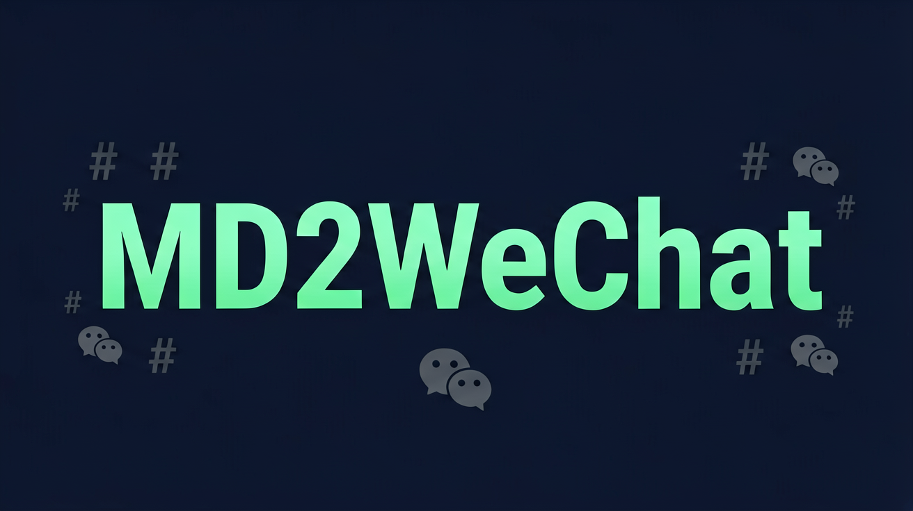

<p align="center">
  
</p>

<h1 align="center">📝 MD2WeChat Pro</h1>

> Convert Markdown to WeChat Official Account articles — pure frontend, no backend needed, visual style customization, copy & paste directly.

📄 [中文](./README.md) | English

## 🎯 What Problem Does It Solve

WeChat Official Account editor doesn't support Markdown. Manual formatting is tedious. This tool converts Markdown to WeChat-compatible rich text with **all styles automatically inlined**, so you can copy and paste directly into the WeChat editor without losing formatting.

## ✨ Features

- 📝 **Live Preview** — Edit Markdown on the left, see WeChat rendering on the right in real-time
- 🎨 **10 Built-in Templates** — Classic Green, Business Blue, Elegant Purple, Vibrant Orange, Minimal Gray, Tech Dark, Literary, Pink Girl, China Red, Academic
- 🎛️ **Visual Style Panel** — Color pickers, font size slider, line height slider, letter spacing slider, text alignment, font family, H2 style — changes apply instantly
- 🎲 **Random Color Scheme** — Generate random color palettes with one click
- 💾 **Save/Load Schemes** — Save style configs as JSON, support import/export and local storage
- 📋 **One-Click Copy** — All styles auto-inlined, paste directly into WeChat editor
- 📥 **Import .md Files** — Import local Markdown files
- 📤 **Export HTML** — Export complete HTML file with code highlighting
- ⌨️ **Shortcuts** — `Cmd/Ctrl+S` or `Cmd/Ctrl+Enter` to copy
- 📱 **Responsive** — Works on mobile too

## 🚀 Quick Start

```bash
git clone https://github.com/yourname/md2wechat.git
cd md2wechat
open index.html   # macOS, or double-click index.html
```

1. Enter Markdown content in the left editor
2. Select a template from the template bar
3. (Optional) Switch to "Style Settings" tab to visually adjust colors and layout
4. Click "Copy" button
5. Paste into WeChat Official Account editor — done!

## 🎨 Built-in Templates

| Template | Primary Color | Style | Use Case |
|----------|--------------|-------|----------|
| Classic Green | `#07c160` | Fresh | General |
| Business Blue | `#1990ff` | Professional | Business |
| Elegant Purple | `#6222c2` | Elegant | Lifestyle |
| Vibrant Orange | `#ff7a45` | Energetic | Marketing |
| Minimal Gray | `#555555` | Minimalist | Tech Docs |
| Tech Dark | `#00d4aa` | Dark Cool | Tech Tutorials |
| Literary | `#8b6914` | Vintage | Essays |
| Pink Girl | `#ec4899` | Sweet | Life Sharing |
| China Red | `#c0392b` | Grand | Festive |
| Academic | `#2c3e50` | Formal | Papers |

## 🎛️ Adjustable Styles

- **Colors**: Primary, secondary, text, link, blockquote, code background, code text, table header
- **Layout**: Font size (12-22px), line height (1.4-2.2), letter spacing (0-3px), text alignment, font family
- **Heading**: H2 style (left border / center underline / gradient / bottom border / plain)

## 💾 Scheme Management

- Save current config as JSON to browser localStorage
- Load from local storage or paste JSON to import
- Copy JSON to share with others

## ⚠️ Technical Notes

### Why all inline styles?

WeChat editor strips `<style>` tags and `class` attributes, keeping only `style="..."` inline styles. The core logic converts all CSS to inline to ensure formatting survives copy-paste.

### Tech Stack

- [marked.js](https://github.com/markedjs/marked) — Markdown parsing
- [highlight.js](https://github.com/highlightjs/highlight.js) — Code syntax highlighting
- Pure HTML + CSS + JavaScript, no framework, no backend

## 🤝 Contributing

Issues and PRs welcome! See [CONTRIBUTING.md](./CONTRIBUTING.md).

## 📄 License

[MIT License](./LICENSE)
